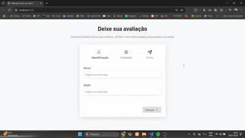

# Formulário Multistep em React

Este é um simples **Formulário Multistep** desenvolvido com **React**. O objetivo é permitir que o usuário preencha um formulário dividido em múltiplas etapas, facilitando a navegação e melhorando a experiência do usuário no preenchimento de dados.

## 🔢 Funcionalidades

- Navegação entre diferentes etapas do formulário
- Validação de campos em cada etapa
- Indicação visual da etapa atual
- Revisão dos dados antes do envio
- Botões para avançar e voltar

## 🧠 Tecnologias utilizadas

- React
- JavaScript (ES6+)
- CSS3

## 💻 Como usar

1. Clone o repositório
2. Instale as dependências com `npm install`
3. Inicie o projeto com `npm run dev`

## 📸 Preview

